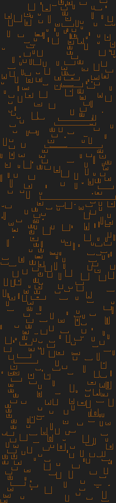

# Advent of Code

My solutions to [Advent of Code](https://adventofcode.com/about) puzzles, written in Rust.
I tend to optimise for code quality, preferring to engineer elegant and efficient solutions to problems rather than racing to get to the answer ASAP.
This repository contains solutions for all 250 puzzles released to date, 25 per year from AoC 2015-2024.

Each year's puzzles are organised into a Cargo workspace consisting of one binary crate per puzzle.
Each puzzle's binary (with a few exceptions):

* aims to solve the puzzle for any valid input, making reasonable simplifying assumptions if necessary;
* aims to minimise the number of out-of-repository dependencies other than Rust's standard library;
* parses the puzzle input from a file called `input.txt` placed in the crate's root directory.

A Bash script [`check.sh`](check.sh) is provided to compile and run all puzzle solutions for a given year, checking their output against that year's `answers.txt` file.
Call the script with the desired year, for example `./check.sh 2015`, `./check.sh all` for all years, or `./check.sh clean` to call `cargo clean` in each year's directory.

An animation demonstrating a recursive solution to [puzzle 17, 2018](https://adventofcode.com/2018/day/17); water flows over the left side of a container, all the way down the reservoir until it settles, and then over the right side:

